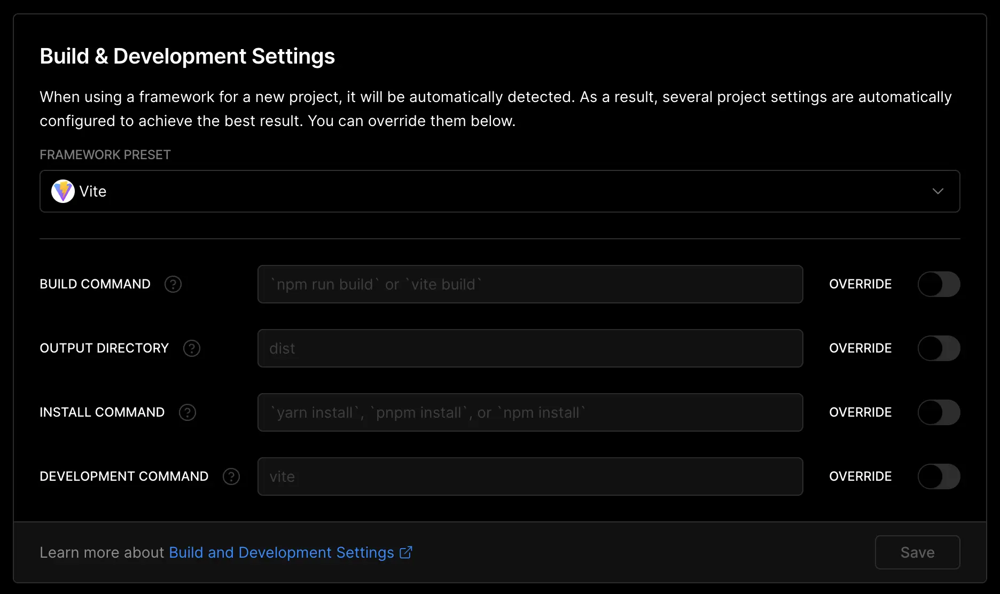
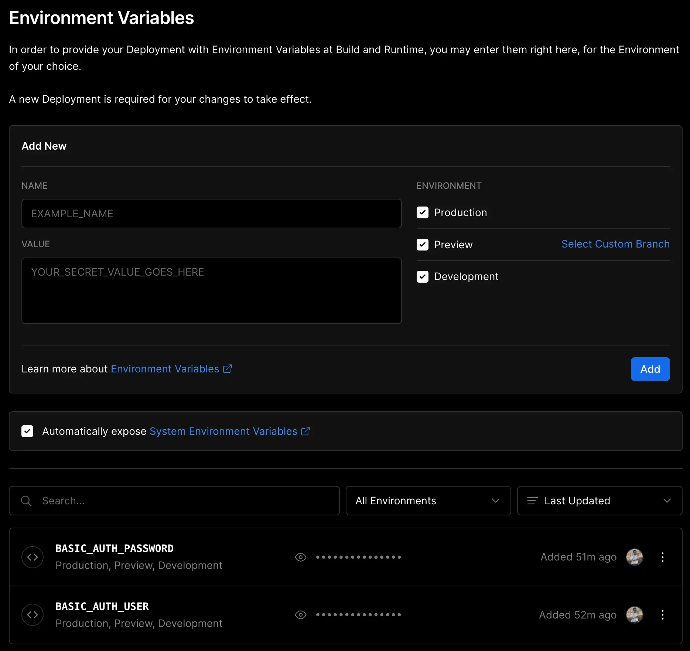

  
<h1 align="center">Vercel - Basic Auth Template (not Next.js)</h1>
  

    For projects that are not Next.js.
     
     
    <a href="https://vercel-basic-auth.vercel.app/">View Demo</a>
	 
	user name : "user" / password : "pass"
  

# Summary
## Project Settings → General
This repository uses Vite, but you can configure your build system.

## Project Settings → Environment Variables
Set the names as `BASIC_AUTH_PASSWORD` and `BASIC_AUTH_USER` and set the user name and password as environment variables, respectively.

